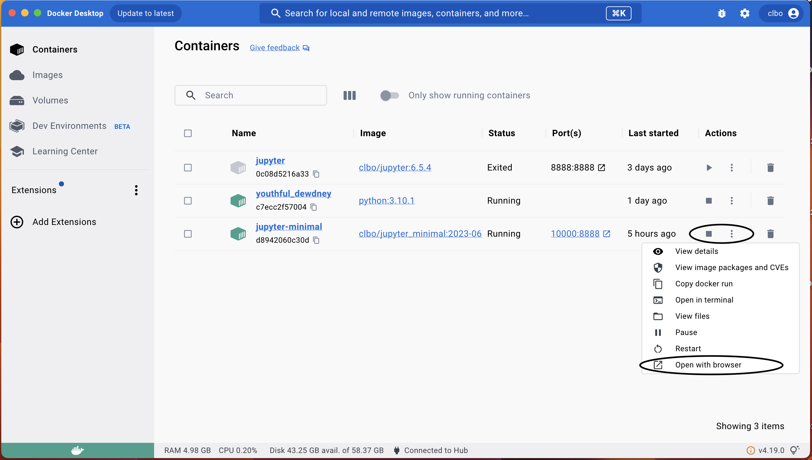

# Installations

This document will describe what you should install in order to follow this elective.   

The IDE we will use in this elective is called **Jupyter Notebook**. Its a browser based IDE and i our case we will install it by creating a Docker image and container from a Dockerfile.


Since Jupyter Notebook is a browser based IDE you will also be able to find it on all the big cloud providors pages, and you are also welcome to do that in a few weeks.

## 1. Docker Desktop
### Download and install Docker Desktop
In order to have a Docker container running on your computer you will need to have Docker desktop installed (unless you are using a Linux OS).

Navigate to the Docker website and download and install Docker Desktop for your operating system.  

[Docker Desktop download](https://www.docker.com/products/docker-desktop)    

### Windows
On Windows you might get some errors concerning WSL2. But error message will decribe what to do. Follow that description, or ask in class.

#### Windows Home 10 users
On Windows Home 10 you could run into some trouble while installing Docker.     
Follow these steps to solve these problems.     
[Install Docker Desktop on Windows Home](https://docs.docker.com/docker-for-windows/install-windows-home/)

### Check if everything is installed
In your terminal or powershell you should type ``` docker --version ``` and get the following result.

````
	$ docker --version 
	Docker version 20.10.17, build 100c701
````

If you do not see this, get an error or like, then you still do not have docker installed on your system. 

## 2. Build an image and run the Container
1. First clone this repository and cd into it:

```
    git clone https://github.com/python-elective-kea/fall2023-code-examples-from-teachings.git
```
You can rename the folder if you want, or just leave it as it is.

```
    mv fall2023-code-examples-from-teachings python
```

After this CD into the folder

```
    cd fall2023-code-examples-from-teachings
```

Run the following docker command

```
    docker build --tag jupyter_minimal:2023-06-12 .
```
This will create the image.

Run this command:

```
    docker run -it -name jupyter-minimal -p 8888:8888 -v "${PWD}":/home/jovyan/work jupyter_minimal:2023-06-12

```
This will crerate and start a container.

A the buttom in your terminal you will see this:

```
    To access the server, open this file in a browser:                                                 
        file:///home/jovyan/.local/share/jupyter/runtime/jpserver-7-open.html                          
    Or copy and paste one of these URLs:                                                               
        http://d8942060c30d:8888/lab?token=c2ebc25800d7031c675fb592ea38ed1020725ce75d8d7e1c            
        http://127.0.0.1:8888/lab?token=c2ebc25800d7031c675fb592ea38ed1020725ce75d8d7e1c 
```

You should copy the **token** which in the case above is this:

```
    c2ebc25800d7031c675fb592ea38ed1020725ce75d8d7e1c
```

Open your browser and type in this url:

```
    http://127.0.0.1:8888
```
A little down on this page you will find two input fields a **token** and a **password** field.

Paste in your token in the token field and create a password (an easy password is sufficient).

Thats it, you can now close your browser and stop the terminal from serving the notebook. (ctrl+c)

## Start and stopping the Jupyter Notebook

Find the Docker Desktop application (GUI) and open it.

Here you can start and stop the container and open it in the browser.



## Reinstall and files 
If you need to or wish you can at any time delete the container and do the **run** command again to start a fresh copy of the container.

```
    docker run -it -name jupyter-minimal -p 8888:8888 -v "${PWD}":/home/jovyan/work jupyter_minimal:2023-06-12

```
Your files will be in the repository you cloned

```
    fall2023-code-examples-from-teachings
```
And they will not be deleted when you delete the container.
You will also be able to access these files in other editors if you wish.
